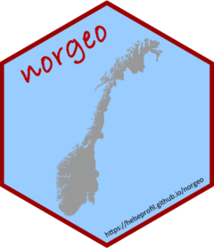

---
output:
  md_document:
    variant: gfm
html_preview: false
---

```{r, include = FALSE}
knitr::opts_chunk$set(
  collapse = TRUE,
  comment = "#>",
  fig.path = "man/figures/README-",
  out.width = "100%"
)
```


# norgeo 


```{r echo=FALSE, results="hide", message=FALSE}
library("badger")
```

```{r, echo = FALSE, results='asis'}
cat(
  badge_github_actions(),
  badge_codecov("helseprofil/norgeo"),
  badge_cran_release("norgeo", "green"),
  badge_lifecycle("maturing", "blue"),
  badge_devel("helseprofil/norgeo", "blue")
)
```


Regional granularity levels in Norway which are depicted by different codes,
have undergone several changes over the years. Identifying when codes have
changed and how many changes have taken place over several years can be
troublesome. This package will help to identify these changes and when the
changes have taken place. One of the limitation of this package is that it is
heavily depending on the codes available from SSB which can be accessed from
their
[website](https://www.ssb.no/befolkning/artikler-og-publikasjoner/regionale-endringer-2020).

## Installation

`norgeo` package can be installed directly from CRAN or via **GitHub** page of
[Helseprofil](https://github.com/helseprofil). You can run the code below for
installation. 

``` r
install.packages("norgeo")
```

If you want to install the development version then use `remotes` package to
access to the **GitHub**. Running the codes below will install development
version of `norgeo`.

```{r dev, eval=FALSE}
if(!require(remotes)) install.packages("remotes")
remotes::install_github("helseprofil/norgeo")
```


## Usage

The data is downloaded via API form SSB
[website](https://data.ssb.no/api/klass/v1/api-guide.html "ssb"). To learn how
to use the different functions in **norgeo**, please read the tutorial under
[Get Started](https://helseprofil.github.io/norgeo/articles/use-api.html)

## Output

Among the output produced by the function `get_change()` is as follows:


The data elucidate the complexity of all the codes change. For Larvik for
instance, the municipality has grown in 2020 with the inclusion of Lardal.
Therefore the code for Larvik has changed twice. How about Holmestrand? When
there are more than 350 municipalities with different code changes, then
tracking these can be a nightmare. The same with enumeration units ie.
*grunnkrets* with 14000 units!
